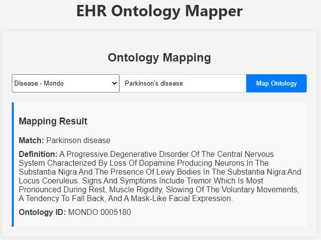

# EHR Ontology Mapper

This project aims to build an EHR (Electronic Health Record) ontology mapping tool with a React frontend and a FastAPI Python backend. It is designed to facilitate the mapping of various EHR ontologies, making it easier for healthcare providers to integrate and manage their data.



## Getting Started

To get a local copy up and running follow these simple steps.

### Prerequisites

Before you begin, ensure you have the latest version of npm installed. You can install npm with the following command:

```bash
npm install npm@latest -g
```

Additionally, you will need Python 3.8 or later to run the FastAPI backend. You can download Python from [here](https://www.python.org/downloads/).

### Installation

1. Clone the repository:

```bash
git clone https://github.com/mcc-ad/ehr_ontology_mapping.git
```

2. Install NPM packages:

```bash
cd ehr-ontology-mapper
npm install
```

3. Install Python dependencies:

```bash
pip install -r requirements.txt
```

### Running the Application

To run the application, you will need to start both the frontend and the backend servers.

1. Start the React frontend:

```bash
npm start
```

This command starts the frontend on [http://localhost:3000](http://localhost:3000).

2. Start the FastAPI backend:

```bash
uvicorn main:app --reload
```

The backend server will start on [http://localhost:8000](http://localhost:8000).

## Usage

Navigate to [http://localhost:3000](http://localhost:3000) in your browser to view the application. From there, you can use the interface to map EHR ontologies as needed.

## Contributing

Contributions are what make the open-source community such an amazing place to learn, inspire, and create. Any contributions you make are **greatly appreciated**.

1. Fork the Project
2. Create your Feature Branch (`git checkout -b feature/AmazingFeature`)
3. Commit your Changes (`git commit -m 'Add some AmazingFeature'`)
4. Push to the Branch (`git push origin feature/AmazingFeature`)
5. Open a Pull Request

## License

Distributed under the MIT License. See `LICENSE` for more information.

## Contact

Your Name - [xiaoqian.jiang@uth.tmc.edu](mailto:xiaoqian.jiang@uth.tmc.edu)

Project Link: [https://mcc-ad.github.io/home/](https://mcc-ad.github.io/home/)

## Acknowledgements

- [React](https://reactjs.org/)
- [FastAPI](https://fastapi.tiangolo.com/)
- [SQLAlchemy](https://www.sqlalchemy.org/)
- [Axios](https://github.com/axios/axios)
- [React Router](https://reactrouter.com/)
